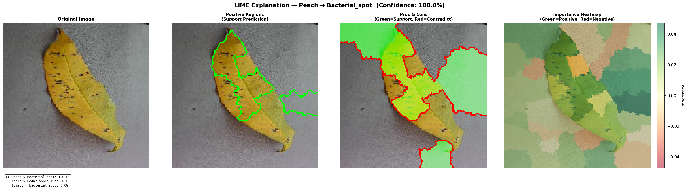

# 🌿 Plant Health Check — Leaf Disease Detection with AI Explainability

A deep learning project that **classifies plant leaf diseases** into **39 categories** using a Convolutional Neural Network, and then **explains _why_ the model made its prediction** using two industry-standard explainability techniques: **LIME** and **SHAP**.

> **Why does this matter?**  
> A model that says _"this leaf has Late Blight"_ is useful — but a model that says _"this leaf has Late Blight **because of the brown lesion area on the lower half**"_ is trustworthy. This project bridges that gap.

---

## 📸 Results

### Training Performance

| Metric | Value |
|--------|-------|
| Training Accuracy | ~96.9% |
| Validation Accuracy | ~89% |
| Training Loss | 0.096 |
| Validation Loss | 0.44 |
| Classes | 39 |
| Epochs | 5 |

<p align="center">
  
</p>

### Confusion Matrix (Normalized)

The confusion matrix shows how well the model performs across all 39 disease classes. Values on the diagonal (top-left to bottom-right) represent correct predictions — the darker the red, the better the accuracy for that class.

<p align="center">
  
</p>

### Precision-Recall Curves

Each curve represents one disease class. A curve closer to the top-right corner means better performance. The **AP (Average Precision)** score next to each class name summarizes overall performance — closer to 1.0 is better.

<p align="center">
  
</p>

### LIME Explanation Example

LIME highlights **which regions of the leaf** the model focuses on to make its prediction. Green boundaries mark areas that **support** the prediction, red areas **contradict** it.

<p align="center">
  
</p>

---

## 🧠 How It Works

### Step 1 — Classification

A leaf image is fed into a pre-trained CNN model (`leaf_disease_model.h5`). The model outputs probabilities across 39 classes (e.g., `Tomato > Late_blight: 48.7%`, `Potato > Late_blight: 39.2%`).

### Step 2 — Explainability

Two different methods explain the model's decision:

| Method | How It Works | What You See |
|--------|-------------|--------------|
| **LIME** | Hides different parts of the image (~1000 times), observes how the prediction changes, and identifies which regions matter most | Green/red boundary regions on the leaf |
| **SHAP** | Uses Shapley values (from game theory) to calculate the **exact contribution** of each pixel to the prediction | Red/blue heatmap — red pixels push toward the prediction, blue push against it |

**When both methods highlight the same leaf regions**, it confirms the model is learning real disease patterns (e.g., brown lesions, spots) and not shortcuts like background color or lighting.

---

## 🗂️ Project Structure

```
plant-health-check/
│
├── leaf_disease_model.h5          # Trained CNN model (39 classes)
├── training_graph.png             # Training loss/accuracy plot
├── confusion_matrix_final.png     # Normalized confusion matrix
├── precision_recall_curve_multi.png  # Per-class PR curves
│
├── data/
│   └── test/                      # Test images organized by class
│       ├── Apple___Apple_scab/
│       ├── Tomato___Late_blight/
│       ├── Corn___Common_rust/
│       └── ... (39 class folders)
│
├── src/
│   ├── config.py                  # Model loading, preprocessing, shared utilities
│   ├── lime_explainer.py          # LIME explainability integration
│   ├── shap_explainer.py          # SHAP explainability integration
│   ├── explain.py                 # CLI runner (runs LIME + SHAP + comparison)
│   ├── generate_metrics.py        # Generates training graph, confusion matrix, PR curves
│   ├── load_dataset.py            # Loads test dataset using ImageDataGenerator
│   └── test_model.py              # Quick model loading test
│
├── outputs/                       # Generated explanation images
│   ├── lime/                      # LIME explanation PNGs
│   ├── shap/                      # SHAP explanation PNGs
│   └── comparison/                # Side-by-side comparison PNGs
│
└── assets/                        # Images used in README
```

---

## 🚀 Getting Started

### Prerequisites

- Python 3.8+
- pip

### Installation

```bash
# Clone the repo
git clone https://github.com/notyoursreejon/plant-health-check.git
cd plant-health-check

# Create virtual environment
python -m venv venv
venv\Scripts\activate          # Windows
# source venv/bin/activate     # Mac/Linux

# Install dependencies
pip install tensorflow numpy matplotlib seaborn scikit-learn scikit-image lime shap
```

### Download the Model

Place the trained model file `leaf_disease_model.h5` in the project root directory. Also ensure the test dataset is placed under `data/test/` with class subfolders.

---

## 🌐 Web Application

We've built a full-stack, AI-powered web application providing an intuitive UI for leaf disease detection and visual explainability.

### 1. Start the Backend API (FastAPI)

Open a terminal, activate your virtual environment, and run:

```bash
cd backend
pip install -r requirements.txt
uvicorn main:app --reload
```
The backend API will start on `http://localhost:8000`.

### 2. Start the Frontend UI (Vite + React)

Open a second terminal window and run:

```bash
cd frontend
npm install
npm run dev
```
The frontend will be available at `http://localhost:5173`. Open this URL in your browser to interact with the Plant Health Check app!

---

## 📖 CLI Usage

### Generate Evaluation Metrics

```bash
python src/generate_metrics.py
```

This creates three files:
- `training_graph.png` — Training loss and accuracy curves
- `confusion_matrix_final.png` — Normalized confusion matrix heatmap
- `precision_recall_curve_multi.png` — Per-class precision-recall curves

### Run Explainability

```bash
# Run both LIME + SHAP (generates comparison too)
python src/explain.py --image "data/test/Tomato___Late_blight/image.jpg"

# LIME only (~30 seconds)
python src/explain.py --image "data/test/Tomato___Late_blight/image.jpg" --lime-only

# SHAP only (~1-5 minutes)
python src/explain.py --image "data/test/Tomato___Late_blight/image.jpg" --shap-only
```

Images auto-open after generation. Outputs are saved to `outputs/lime/`, `outputs/shap/`, `outputs/comparison/`.

### Quick Tests

```bash
# Test if model loads correctly
python src/test_model.py

# Test if dataset loads correctly
python src/load_dataset.py
```

---

## 🔬 Supported Disease Classes (39)

| Plant | Diseases |
|-------|----------|
| Apple | Apple Scab, Black Rot, Cedar Apple Rust, Healthy |
| Blueberry | Healthy |
| Cherry | Powdery Mildew, Healthy |
| Corn | Cercospora Leaf Spot (Gray Leaf Spot), Common Rust, Northern Leaf Blight, Healthy |
| Grape | Black Rot, Esca (Black Measles), Leaf Blight (Isariopsis Leaf Spot), Healthy |
| Orange | Haunglongbing (Citrus Greening) |
| Peach | Bacterial Spot, Healthy |
| Pepper Bell | Bacterial Spot, Healthy |
| Potato | Early Blight, Late Blight, Healthy |
| Raspberry | Healthy |
| Soybean | Healthy |
| Squash | Powdery Mildew |
| Strawberry | Leaf Scorch, Healthy |
| Tomato | Bacterial Spot, Early Blight, Late Blight, Leaf Mold, Septoria Leaf Spot, Spider Mites, Target Spot, Yellow Leaf Curl Virus, Mosaic Virus, Healthy |
| Background | Without Leaves |

---

## 🛠️ Tech Stack

| Component | Technology |
|-----------|------------|
| Deep Learning Framework | TensorFlow / Keras |
| Model Architecture | CNN (MobileNetV2-based) |
| Explainability | LIME, SHAP |
| Visualization | Matplotlib, Seaborn |
| Evaluation | scikit-learn |
| Dataset | PlantVillage (39 classes) |
| Language | Python 3.8+ |

---

## 📄 License

This project is for educational and research purposes.

---

## 🙏 Acknowledgements

- [PlantVillage Dataset](https://github.com/spMohanty/PlantVillage-Dataset) — Open-source plant disease image dataset
- [LIME](https://github.com/marcotcr/lime) — Local Interpretable Model-agnostic Explanations
- [SHAP](https://github.com/shap/shap) — SHapley Additive exPlanations
- TensorFlow / Keras — Deep learning framework
