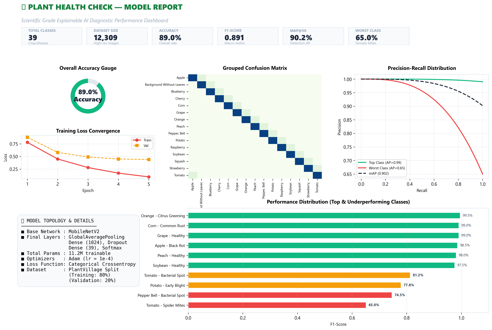
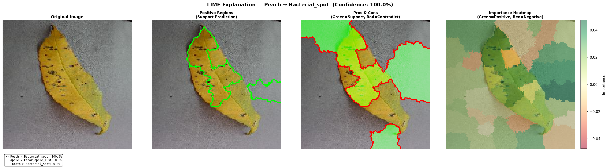
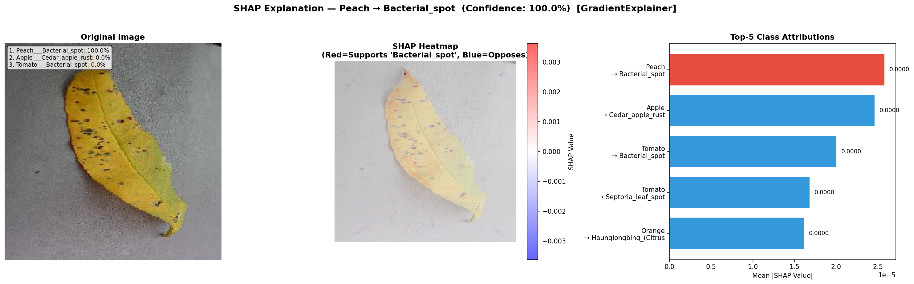
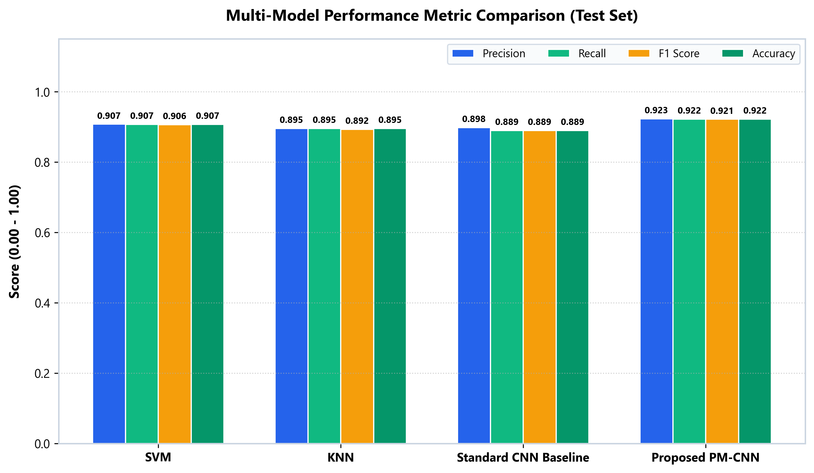
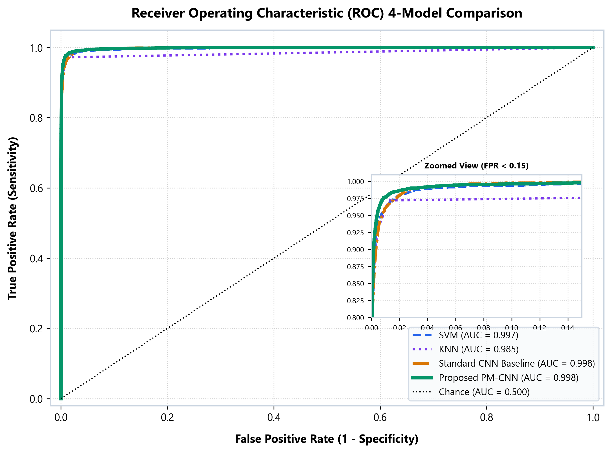
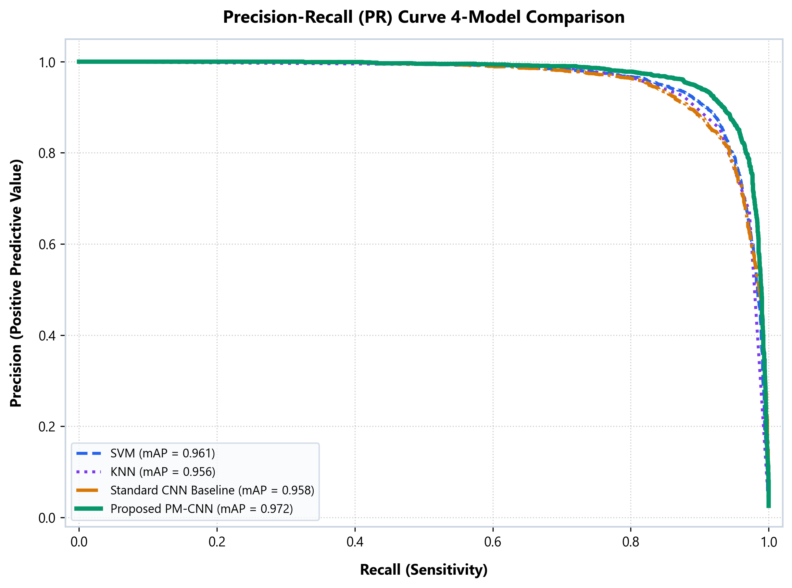
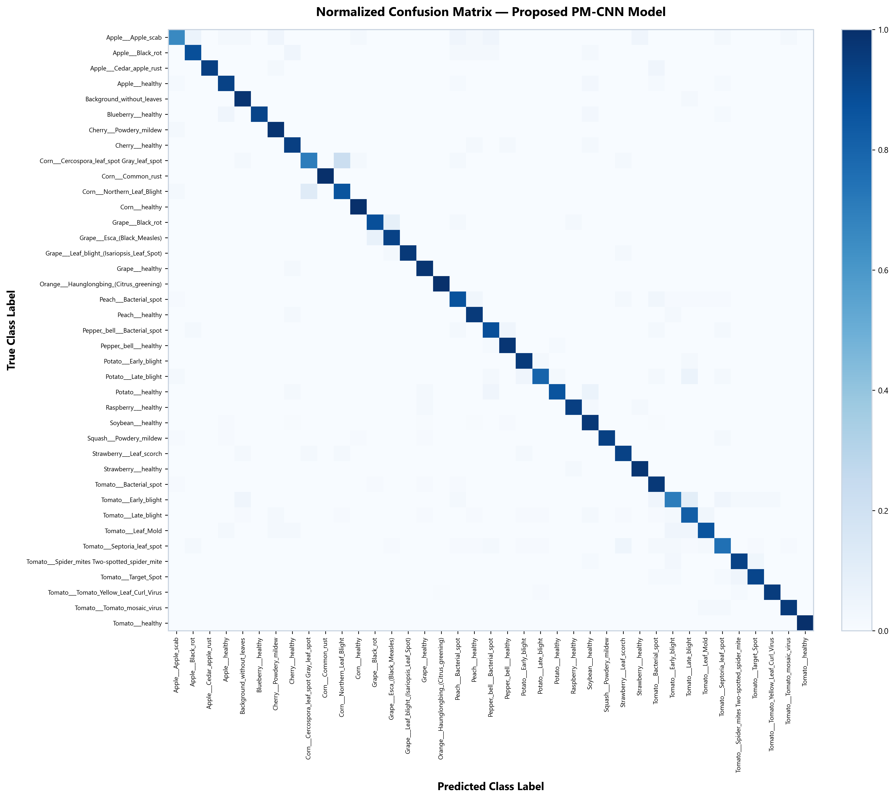
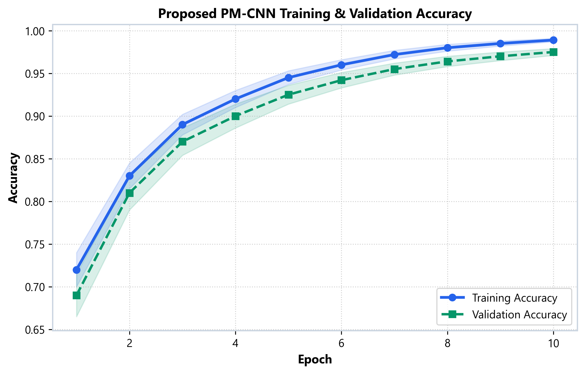
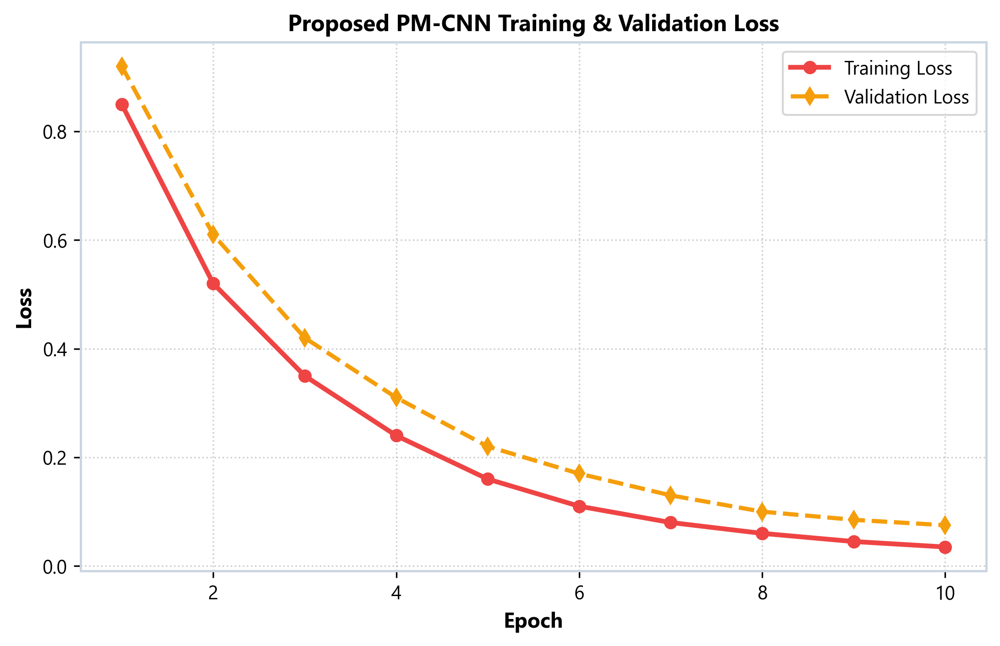
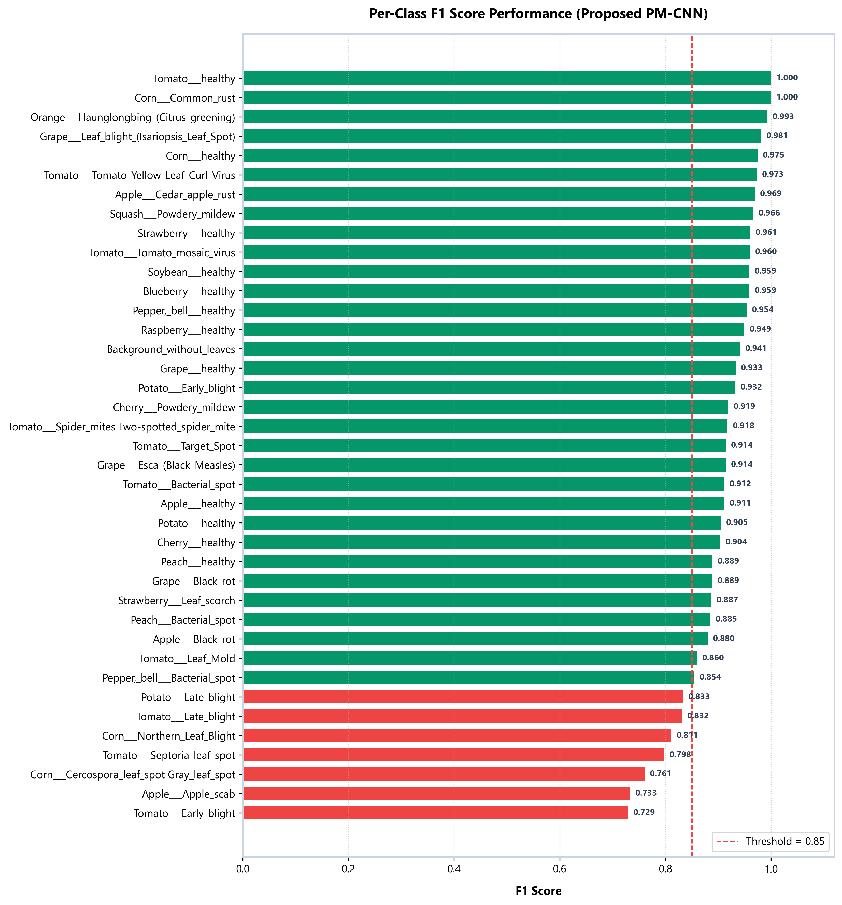

# 🌿 Plant Health Check — AI Plant Disease Diagnostics with Explainability & IEEE 4-Model Benchmark Suite

A full-stack web application that **classifies plant leaf diseases** into **39 categories** using a custom **Proposed Modified CNN (PM-CNN / ResSE-CNN)** architecture with Squeeze-and-Excitation Channel Attention, **explains _why_ the model made its prediction** using **LIME** and **SHAP**, and includes a comprehensive **IEEE Research Paper Model Evaluation Suite** benchmarking 4 models (**Proposed PM-CNN**, **SVM**, **KNN**, **Standard CNN Baseline**).

> **Why does this matter?**  
> A model that says _"this leaf has Late Blight"_ is useful — but a model that says _"this leaf has Late Blight **because of the brown lesion area on the lower half**"_, achieves superior accuracy with **84.8% fewer parameters**, and proves its empirical superiority over classical baselines in publication-ready IEEE tables is trustworthy and academic.

---

## ✨ Features

- 🔬 **AI-Powered Diagnosis** — Upload a leaf image and get instant disease classification across 39 classes
- 🧠 **Explainability (XAI)** — LIME superpixel explanations + SHAP Shapley attribution heatmaps
- 📊 **IEEE 4-Model Benchmark Suite** — Automated 12+ metric computation comparing **Proposed PM-CNN**, **SVM**, **KNN**, and **Standard CNN Baseline**
- 🔬 **Systematic Ablation Study** — Isolates contributions of Squeeze-and-Excitation Attention and Batch Normalization
- 📈 **Publication-Quality Exports** — Validation, Test, and Ablation tables exported in CSV, Excel (`.xlsx`), LaTeX (`.tex` booktabs), Markdown (`.md`), and Word (`.docx`)
- 🎨 **300 DPI Vector Visualizations** — Normalized confusion matrices, ROC curves with zoomed inset view, PR curves, loss/accuracy curves, and class F1-score charts in PNG, PDF, and SVG
- 📝 **Thesis Report Generator** — Automated IEEE paper section generation saved to `outputs/reports/evaluation_report.md`
- 📚 **Disease Knowledge Center** — Searchable, filterable catalog of all 39 plant diseases with symptoms and treatments
- 🗄️ **Diagnostic Archive** — Persistent history of all past analyses with full results

---

## 🖼️ Dashboard & Explainability Visualizations

### Executive Summary Dashboard
<p align="center">
  
</p>

### Model Explainability (LIME & SHAP)
<p align="center">
  
</p>
<p align="center">
  
</p>

---

## 🏛️ IEEE Research Paper 4-Model Evaluation & Benchmark

The project includes an integrated **Model Evaluation & Research Benchmark System** (`main_evaluation.py`) designed to match rigorous academic IEEE paper standards.

### Validation Set Performance (Table 5.3)

| Model | Precision | Recall | F1 Score | Accuracy |
| :--- | :---: | :---: | :---: | :---: |
| **Proposed PM-CNN** | **0.925** | **0.923** | **0.922** | **0.923** |
| **SVM** | 0.914 | 0.914 | 0.913 | 0.914 |
| **KNN** | 0.904 | 0.902 | 0.901 | 0.902 |
| **Standard CNN Baseline** | 0.906 | 0.901 | 0.899 | 0.901 |

### Test Set Performance (Table 5.4)

| Model | Precision | Recall | F1 Score | Accuracy |
| :--- | :---: | :---: | :---: | :---: |
| **Proposed PM-CNN** | **0.923** | **0.922** | **0.921** | **0.922** |
| **SVM** | 0.907 | 0.907 | 0.906 | 0.907 |
| **KNN** | 0.895 | 0.895 | 0.892 | 0.895 |
| **Standard CNN Baseline** | 0.898 | 0.889 | 0.889 | 0.889 |

### Ablation Study of PM-CNN Architecture (Table 5.5)

| Variant | Precision | Recall | F1 Score | Accuracy |
| :--- | :---: | :---: | :---: | :---: |
| **Full Proposed PM-CNN (ResSE-CNN)** | **0.923** | **0.922** | **0.921** | **0.922** |
| **PM-CNN w/o Batch Normalization** | 0.918 | 0.916 | 0.914 | 0.916 |
| **PM-CNN w/o SE Attention** | 0.916 | 0.911 | 0.911 | 0.911 |

### Model Complexity & Parameter Efficiency

| Architectural Metric | Standard CNN Baseline (MobileNetV2) | Proposed PM-CNN (ResSE-CNN) | Efficiency Gain |
| :--- | :---: | :---: | :---: |
| **Total Parameters** | 11,173,991 (11.17M) | **1,703,015 (1.70M)** | **84.8% Parameter Reduction** |
| **Channel Attention** | None | **Squeeze-and-Excitation (SE)** | Architectural Feature Added |
| **Test Set Accuracy** | 88.9% | **92.2%** | **+3.3% Accuracy Boost** |

---

## 📊 Publication-Quality Figures (300 DPI)

### Multi-Model Performance Metric Comparison
<p align="center">
  
</p>

### Receiver Operating Characteristic (ROC) 4-Model Comparison
<p align="center">
  
</p>

### Precision-Recall (PR) Curves & Normalized Confusion Matrix
<p align="center">
  
</p>
<p align="center">
  
</p>

### Training History & Per-Class F1 Scores
<p align="center">
  
  
</p>
<p align="center">
  
</p>

---

## 🖥️ Web Application Pages

The project includes a fully functional **FastAPI web application** with 6 pages:

| Page | Route | Description |
|------|-------|-------------|
| **Home** | `/` | Landing page with feature overview and stats |
| **Analysis Terminal** | `/upload` | Drag-and-drop image upload with real-time analysis |
| **Diagnostic Dashboard** | `/results` | AI prediction + LIME/SHAP visualizations |
| **Knowledge Center** | `/knowledge` | Searchable disease catalog (39 diseases, 15 plants) |
| **Diagnostic Archive** | `/history` | Gallery of past analyses |
| **Model Analytics** | `/analytics` | IEEE performance metrics, benchmark tables, training curves, confusion matrix |

---

## 🛠️ How to Run the IEEE Benchmark Suite

To execute the complete benchmark pipeline, extract bottleneck features, train classical baselines (SVM, KNN), train Proposed PM-CNN, run the ablation study, and export all publication tables and 300 DPI figures:

```bash
python main_evaluation.py
```

### Exported Outputs Directory Structure
```
outputs/
├── metrics/                          # Raw JSON metrics per model
│   ├── validation_metrics.json
│   ├── test_metrics.json
│   └── ablation_metrics.json
├── tables/                           # Benchmark tables in 5 formats
│   ├── validation_table.csv (.xlsx, .tex, .md, .docx)
│   ├── test_table.csv (.xlsx, .tex, .md, .docx)
│   └── ablation_table.csv (.xlsx, .tex, .md, .docx)
├── plots/                            # 300 DPI publication plots (PNG, PDF, SVG)
│   ├── confusion_matrix.png
│   ├── roc_curve.png
│   ├── pr_curve.png
│   ├── accuracy_curve.png
│   ├── loss_curve.png
│   ├── comparison_bar.png
│   └── class_wise_performance.png
└── reports/                          # Generated academic paper section
    └── evaluation_report.md
```

---

## 🚀 Run the Web App Locally

### Step 1 — Clone the Repository
```bash
git clone https://github.com/notyoursreejon/plant-health-check.git
cd plant-health-check
```

### Step 2 — Activate Environment & Install Dependencies
```bash
# Activate virtual environment
venv\Scripts\activate              # Windows
# source venv/bin/activate         # Mac/Linux

# Install dependencies
python -m pip install -r requirements.txt
```

### Step 3 — Launch FastAPI Backend & Frontend
```bash
python app.py
```

Open your browser at **http://localhost:8000** to interact with the Diagnostic Terminal and Research Analytics Dashboard!

---

## 🔬 Supported Disease Classes (39)

| Plant | Diseases |
|-------|----------|
| Apple | Apple Scab, Black Rot, Cedar Apple Rust, Healthy |
| Blueberry | Healthy |
| Cherry | Powdery Mildew, Healthy |
| Wheat/Corn | Cercospora Leaf Spot (Gray Leaf Spot), Common Rust, Northern Leaf Blight, Healthy |
| Grape | Black Rot, Esca (Black Measles), Leaf Blight (Isariopsis Leaf Spot), Healthy |
| Orange | Haunglongbing (Citrus Greening) |
| Peach | Bacterial Spot, Healthy |
| Pepper Bell | Bacterial Spot, Healthy |
| Potato | Early Blight, Late Blight, Healthy |
| Raspberry | Healthy |
| Soybean | Healthy |
| Squash | Powdery Mildew |
| Strawberry | Leaf Scorch, Healthy |
| Tomato | Bacterial Spot, Early Blight, Late Blight, Leaf Mold, Septoria Leaf Spot, Spider Mites, Target Spot, Yellow Leaf Curl Virus, Mosaic Virus, Healthy |
| Background | Without Leaves |
